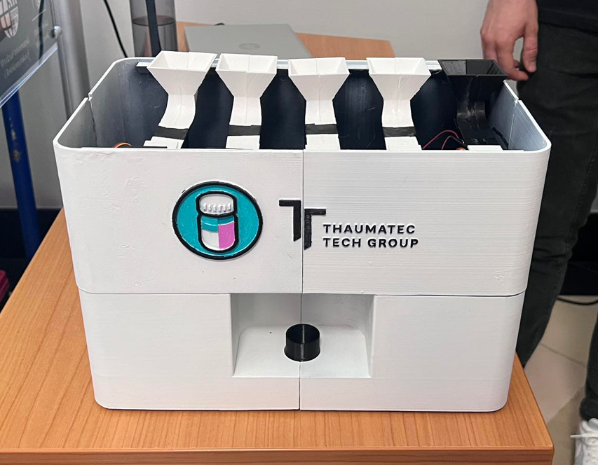
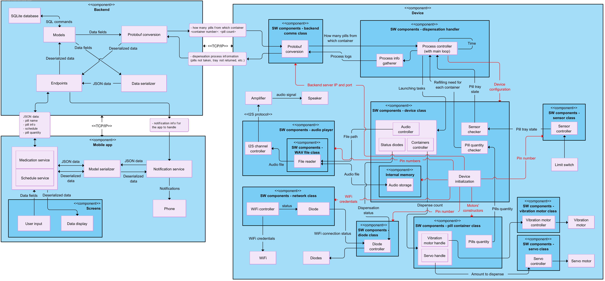

# Smart Medicine Dispenser

## About

Smart Medicine Dispenser's aim is to help elderly or chronically ill individuals in the process of taking medications. ESP32-based device storing up to 5 different pill types, dispensing them according to the schedule, and notifying users. Mobile app to oversee the process, notify users and modify the schedule. Everything going through backend server storing and managing all data, using Protobuf protocol. This repository contains only device firmware.


-------------------------

Final device

-------------------------
<video width="600" controls>
  <source src="images/video.mp4" type="video/mp4">
</video>

How the mechanism works

## System architecture




## System requirements

### Hardware:

* ESP32-S3-based development board
* 5x SG-90 servo motors
* 5x MT48 vibration motors
* MAX98357A audio amplifier + a speaker
* 1x limit switch

### Software:

* [PlatformIO IDE](https://platformio.org/) for VSCode
* [Nanopb](https://github.com/nanopb/nanopb) - plain-C, lightweight implementation of Protobuf

## Installation

1. Clone the repository

```
git clone https://github.com/hixo356/smart-medicine-dispenser.git
```

2. Open cloned repository in VSCode with PlatformIO.

3. Upload board configuration.

4. Build and upload filesystem image.

5. Upload firmware to your board.

## TODO

* Send more feedback from the device to the backend server
* Encapsulate more in the ServerConnection class to clear other areas of the code
* Make more use of the config, make ServerConnection and WiFi actually use them
